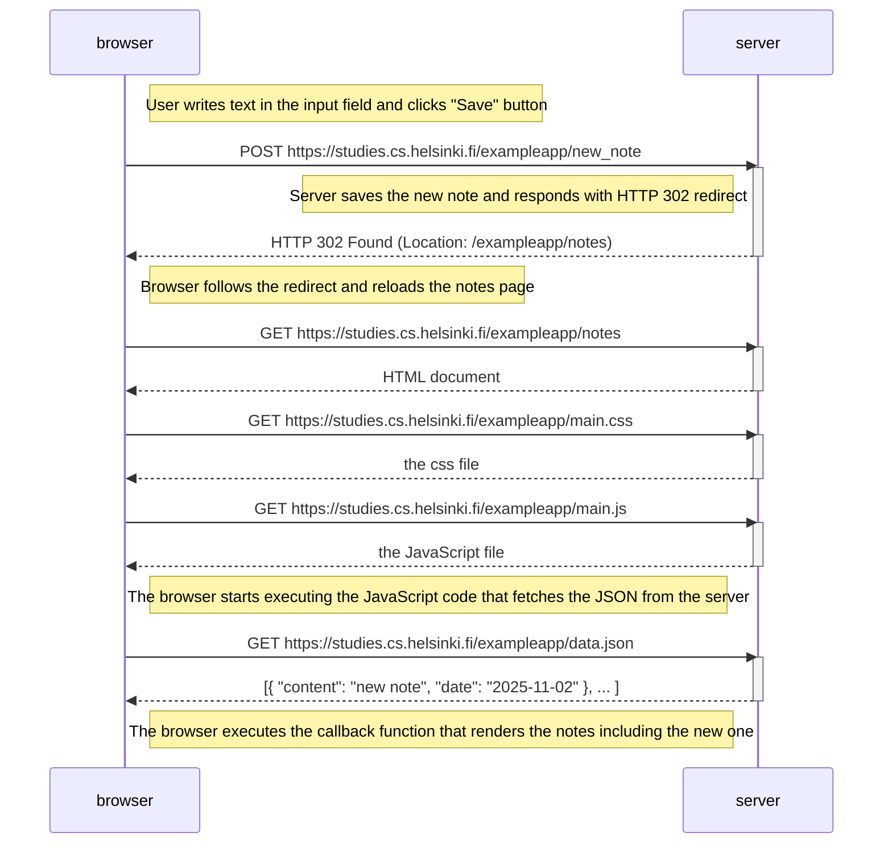

# 0.4: New note diagram

This diagram depicts the situation where the user creates a new note on the page https://studies.cs.helsinki.fi/exampleapp/notes by writing something into the text field and clicking the Save button.

## Explanation of the process:

1. **User action**: User types text into the form field and clicks the "Save" button
2. **POST request**: Browser sends a POST request to `/new_note` endpoint with the form data
3. **Server processing**: Server receives the data, saves the new note, and responds with HTTP 302 redirect
4. **Redirect**: Browser automatically follows the redirect to `/exampleapp/notes`
5. **Page reload**: The entire page loading process repeats:
   - HTML document is fetched
   - CSS file is loaded
   - JavaScript file is loaded
   - JavaScript executes and fetches the updated JSON data (now including the new note)
   - Notes are rendered on the page

The key difference from simply loading the page is the initial POST request that submits the new note data to the server.
