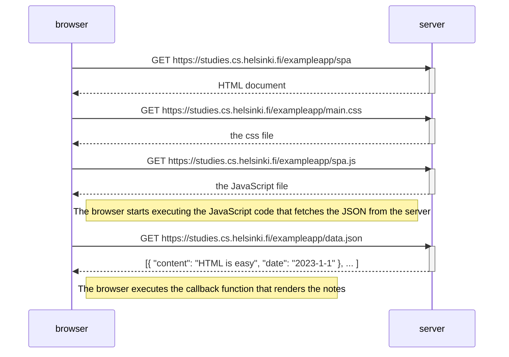

# 0.5: Single page app diagram

This diagram depicts the situation where the user goes to the single-page app version of the notes app at https://studies.cs.helsinki.fi/exampleapp/spa.

## Explanation:

The main difference between the traditional app and the SPA version is in the JavaScript file:

- Traditional version loads `main.js`
- SPA version loads `spa.js`

The SPA version uses a different JavaScript file that handles the application logic in a single-page application manner. The initial loading process is similar to the traditional version, but the SPA JavaScript will handle future interactions (like adding new notes) differently - without requiring full page reloads.
