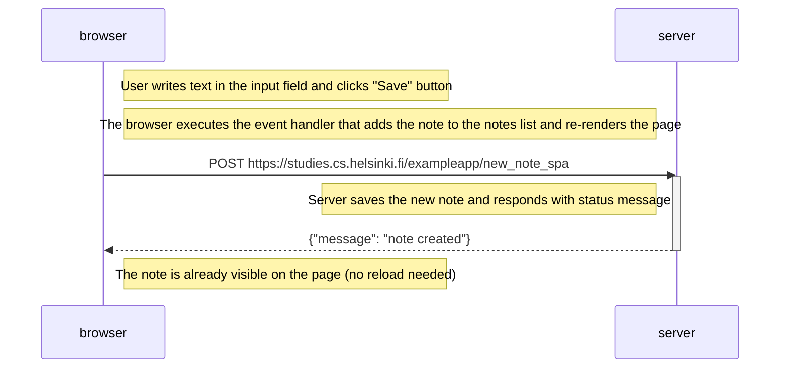

# 0.6: New note in Single page app diagram

This diagram depicts the situation where the user creates a new note using the single-page version of the app at https://studies.cs.helsinki.fi/exampleapp/spa.

## Explanation:

The key difference between the SPA version and the traditional version when creating a new note:

### Traditional app (0.4):

- Sends POST request
- Server responds with redirect (HTTP 302)
- Browser reloads entire page
- All resources (HTML, CSS, JS, JSON) are fetched again

### SPA version (0.6):

1. **JavaScript handles the form submission** - prevents default form behavior
2. **Note is added to DOM immediately** - the browser updates the page locally without reload
3. **POST request is sent in background** - using AJAX/fetch to `/new_note_spa`
4. **Server responds with JSON** - just a confirmation message, not a redirect
5. **No page reload** - the note is already visible, user experience is seamless

This is the core advantage of Single Page Applications - better user experience with no full page reloads!
